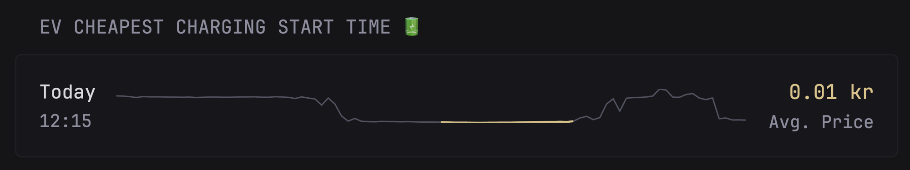

could # ev-charger

Minimal Go HTTP server that powers the **EV Cheapest Charging Start Time** widget on the Glance dashboard. It pulls data from Home Assistant, renders an HTML fragment with an inline SVG price chart, and serves it on port 8000.



## Endpoints

| Path | Purpose |
|---|---|
| `GET /ev-start-time-snippet` | Returns an HTML fragment for a Glance custom widget. Sets `Content-Type: text/html`, `Widget-Title` (from HA's `friendly_name`), `Widget-Content-Type: html`. |
| `GET /health` | Plain `ok` 200 — used by the container healthcheck. |

## Data sources (Home Assistant)

Both calls are `GET /api/states/<entity>` against `https://ha.w8k.site` with the long-lived access token from `HA_TOKEN`:

- `sensor.ev_cheapest_charging_start_time` — `state` is an ISO 8601 timestamp marking when the cheapest 5-hour charging window starts; `attributes.average_price` is the average price during that window; `attributes.friendly_name` is used as the widget title.
- `sensor.nordpool_kwh_se4_sek_3_10_025` — `attributes.today` / `attributes.tomorrow` are float arrays of electricity spot prices at **15-minute resolution** (96 points per day, ±1 around DST). `attributes.tomorrow_valid` indicates whether tomorrow's data is published yet.

If the Nordpool fetch fails or returns no data, the handler falls back to a minimal HTML snippet with just the start time and average price — no chart.

## Chart rendering

The widget shows the cheapest charging start day/time on the left and the average price on the right, with a sparkline in between. The SVG uses `viewBox="0 0 100 50"` with `preserveAspectRatio="none"` — i.e. it stretches to fit the container, so anything circular needs to compensate for the non-uniform scale.

Three SVG elements are layered inside the `<svg>`, in z-order:

1. **Base price line** — polyline of all `combined = today ++ tomorrow_if_valid` points. X is linear `0..100`; Y is min-max normalized into `0..50` and inverted (`50 - scaled`) so higher prices sit higher. Stroke `var(--color-text-subdue)`, width `1.0px`.
2. **Highlight overlay** (`color-primary`) — the 5-hour charging window starting at `data.state`. Computed as `startIdx = floor(hours_since_today_midnight × pointsPerHour)`, with `pointsPerHour = 4` because Nordpool publishes 15-min granularity. The span is `5 × pointsPerHour = 20` data points. Skipped silently if the window falls outside the combined array (e.g. `tomorrow_valid` is false and the cheapest window is tomorrow). Width `1.5px`.
3. **Current-time dot** (`color-highlight`) — slides continuously across the hour via linear interpolation between the two adjacent price points. Rendered as a zero-length `<line>` with `stroke-linecap="round"` and `vector-effect="non-scaling-stroke"`, so it stays a perfectly circular 6 px dot in screen space despite the stretched viewBox. Skipped if "now" is outside the combined array.

All point-index math hangs off the same `pointsPerHour` constant in `main.go:160`. If Nordpool ever changes resolution, that's the one knob.

`getTimeInfo` (`main.go:45`) converts the state timestamp into the day label (`Today` / `Tomorrow` / weekday name) and `HH:MM` time. It relies on `t.Local()`, which is `Europe/Stockholm` because the Dockerfile sets `TZ` and the compose stack also mounts `/etc/localtime`.

## Build & run

**Local:**

```bash
cd ev-charger
go build -o ev-charger .
HA_TOKEN=<long-lived-access-token> ./ev-charger
# serves on http://localhost:8000
```

**Docker** (multi-stage build, scratch base, non-root):

```bash
docker build -t ev-server .
docker stop ev-server && docker rm ev-server   # if already running
```

The Dockerfile targets `linux/arm64` (houdini is Pi-based). Adjust `GOARCH` if building for another platform.

**Deploy** (on houdini): the stack `stacks/ev-charger-start-time/compose.yml` builds from this directory and maps host port `8042 → 8000`. `HA_TOKEN` and `TZ` are read from `.env`. Nginx Proxy Manager / Glance points at `ev-server:8000`.

```bash
docker compose -f stacks/ev-charger-start-time/compose.yml up -d --build
```

## Glance widget config

The widget is declared as a Glance `custom-api` widget in `glance/config/home.yml` pointing at `http://ev-server:8000/ev-start-time-snippet`. The endpoint sets `Widget-Title` and `Widget-Content-Type` headers so Glance treats the response as a pre-rendered HTML fragment.

## Reference

Glance custom widget format: <https://github.com/glanceapp/glance/blob/main/docs/extensions.md>
